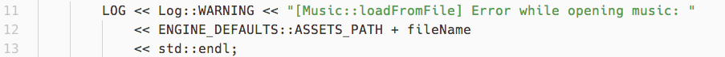

##SimpleCPPLog
---
Biblioteca simples para Log



####Características
---
- Thread safe
- Output para stdout e arquivo
- Suporte para hora
- Multi opções de log (VERBOSE, WARNING, CRITICAL)
- Suporte para um observer


####Uso
---
Para utilizar você precisa incluir o arquivo `LogInc.h` e compilar o arquivo `Log.cpp`.
Para configurar o Log verifique o arquivo `LogInc.h`

Você pode fazer um registro no log de forma fácil utilizando a mesma sintaxe normalmente utilizada para escrever no **stdout** 
```c++
	LOG << "Teste" << std::endl;
```

####std::endl
Você deve utilizar std::endl ao final de toda mensagem de log, já que a o log só é registrado após receber o retorno de **std::endl**.
Você também pode utilizar "\n" como string a vontade, já que o log só é registrado ao receber **std::endl**.


####Observer
Você pode registrar um Observer no Log para interceptar as mensagens dentro de sua aplicação.
Para isso crie uma class que herde da class `LogObserver` e a registre com método `setObserver`
do objecto global `LOG_OBJECT`
```c++
class MyLogHandle : public LogObserver {
public:
	void addMessage(const std::string& buffer) {
		MyDrawTextFunction(buffer);
	}
};

LOG_OBJECT->setObserver(new MyLogHandle);
```

